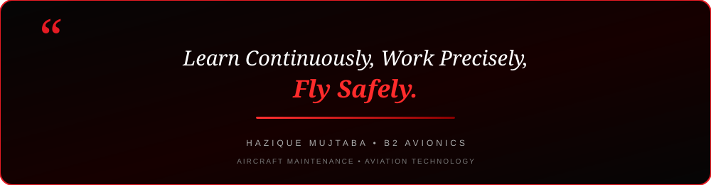

  

  

  
  &nbsp;
  
  &nbsp;
  

  

---

<h2 align="center">🔴 About Me</h2>

  

  

  Hey! I'm <b>Hazique Mujtaba</b>, a <b>B2 Avionics Engineering Student</b> from India. 
  I am currently working as a <b>Junior Aircraft Maintenance Technician cum Store Assistant</b> at <b>International Aircraft Sales Pvt. Ltd. (IASPL)</b>. 
  My aviation experience includes <b>360 hours of practical training</b> at Indamer Technics, with exposure to Airbus A320 Family and A320neo aircraft powered by <b>PW1100G-JM</b> engines. 
  My interests include <b>Aircraft Maintenance, Avionics, Aircraft Electrical Systems, Communication & Navigation Systems, AMM and CAR 145 practices.</b>

  
  &nbsp;
  
  &nbsp;
  

  💬 <b>Let's Discuss:</b> Aircraft Maintenance, B2 Avionics, A320 Family, Electrical Systems, AMM & Aviation. 
  ⚡ <b>Philosophy:</b> <i>"Learn continuously, work precisely, and maintain with safety in mind."</i>

<table width="100%" border="0" align="center">
<tr>
<td width="50%" align="center" style="padding: 14px;">
  <h4>✈️ Aircraft Experience</h4>
  
<b>Airbus A320 Family & A320neo</b> 360+ Hours Practical Training

</td>

<td width="50%" align="center" style="padding: 14px;">
  <h4>🌱 Currently Learning</h4>
  
<b>B2 Avionics & Aircraft Maintenance</b> Systems • Electrical • Maintenance Practices

</td>
</tr>

<tr>
<td width="50%" align="center" style="padding: 14px;">
  <h4>🔧 Technical Focus</h4>
  
<b>Aircraft Avionics & Electrical Systems</b> Communication • Navigation • Wiring

</td>

<td width="50%" align="center" style="padding: 14px;">
  <h4>🤝 Professional Focus</h4>
  
<b>Aircraft Maintenance & Aviation Operations</b> Safety • Accuracy • Teamwork

</td>
</tr>
</table>

---

<h2 align="center">🔴 Aviation Experience</h2>

<table width="100%" border="0" align="center">

<tr>
<td align="center" style="padding: 20px;">
  <h3>✈️ Airbus A320 Family</h3>
  

    Practical exposure to <b>Airbus A320 Family and A320neo</b> aircraft during
    360 hours of hands-on aviation training.
  

  
<b>A320 • A320neo • PW1100G-JM</b>

</td>
</tr>

<tr>
<td align="center" style="padding: 20px;">
  <h3>⚡ Avionics & Electrical Systems</h3>
  

    Practical exposure to aircraft electrical wiring, bonding,
    continuity testing and avionics-related maintenance activities.
  

  
<b>Electrical Wiring • Bonding • Continuity Testing</b>

</td>
</tr>

<tr>
<td align="center" style="padding: 20px;">
  <h3>📡 Communication & Navigation</h3>
  

    Exposure to aircraft communication and navigation systems including
    VHF, HF, ILS and VOR during practical maintenance training.
  

  
<b>VHF • HF • ILS • VOR</b>

</td>
</tr>

<tr>
<td align="center" style="padding: 20px;">
  <h3>📚 Aircraft Maintenance Documentation</h3>
  

    Practical exposure to aircraft maintenance documentation and
    Aircraft Maintenance Manual (AMM) procedures.
  

  
<b>AMM • Maintenance Procedures • Safety Practices</b>

</td>
</tr>

</table>

---

<h2 align="center">🛠️ Technical Skills</h2>

<b>Aircraft & Avionics</b>

  
  &nbsp;
  
  &nbsp;
  

<b>Electrical & Maintenance</b>

  
  &nbsp;
  
  &nbsp;
  
  &nbsp;
  

<b>Communication & Navigation</b>

  
  &nbsp;
  
  &nbsp;
  
  &nbsp;
  

<b>Aviation Standards & Documentation</b>

  
  &nbsp;
  
  &nbsp;
  

---

<h2 align="center">💼 Experience</h2>

<table width="100%" border="0" align="center">

<tr>
<td align="center" style="padding: 18px;">
  <h3>🛠️ Junior Aircraft Maintenance Technician cum Store Assistant — IASPL</h3>
  
<b>June 2026 – Present | Bhopal, India</b>

  

    Working with <b>International Aircraft Sales Pvt. Ltd.</b> and contributing
    to aircraft maintenance and operational activities while developing
    practical aviation and technical skills.
  

</td>
</tr>

<tr>
<td align="center" style="padding: 18px;">
  <h3>✈️ Aircraft Maintenance Trainee — Indamer Technics</h3>
  
<b>January 2026 – April 2026 | Nagpur, India</b>

  

    Completed <b>360 hours</b> of practical training in a DGCA-approved MRO
    facility with exposure to Airbus A320 Family and A320neo aircraft
    powered by PW1100G-JM engines.
  

  

    Assisted with inspections, electrical wiring, bonding, continuity testing,
    VHF/HF communication, ILS/VOR navigation and AMM-based maintenance activities.
  

</td>
</tr>

</table>

---

<h2 align="center">🎓 Education</h2>

  <b>Aircraft Maintenance Engineering — Avionics</b> 
  Institute of Aeronautics & Engineering, Bhopal 
  B2 Avionics • Aircraft Maintenance • Aviation Technology

  <b>Airframe Mechanics and Aircraft Maintenance Technology / Technician</b> 
  Institute of Aeronautics & Engineering, Bhopal

---

<h2 align="center">🏆 Training & Certifications</h2>

  🔴 <b>360-Hour Practical Training / OJT — Indamer Technics</b> 
  🔴 <b>Avionics (B2) — CAR 145 AMO Environment</b> 
  🔴 <b>Airbus A320 Family & A320neo Practical Exposure</b> 
  🔴 <b>Aircraft Electrical & Avionics Systems Exposure</b>

---

<h2 align="center">🌟 Aviation Activities & Practical Exposure</h2>

  🔴 Aircraft Daily / Pre-flight Inspection Exposure 
  🔴 Electrical Wiring, Bonding & Continuity Testing 
  🔴 VHF / HF Communication System Exposure 
  🔴 ILS / VOR Navigation System Exposure 
  🔴 Aircraft Maintenance Manual (AMM) Usage 
  🔴 CAR 145 MRO Environment Exposure

---

<h2 align="center">📊 GitHub Activity</h2>

  

  

---

<h2 align="center">📚 Currently Learning</h2>

  <b>B2 Avionics • Aircraft Maintenance • Aviation Electrical Systems • Communication & Navigation • AMM • CAR 145</b>

---

<h2 align="center">📬 Let's Connect</h2>

  <i>Interested in aviation, aircraft maintenance, avionics, or simply want to connect?</i>

  
  &nbsp;&nbsp;
  

  <b>❤️ Thanks for visiting my profile!</b>

  

