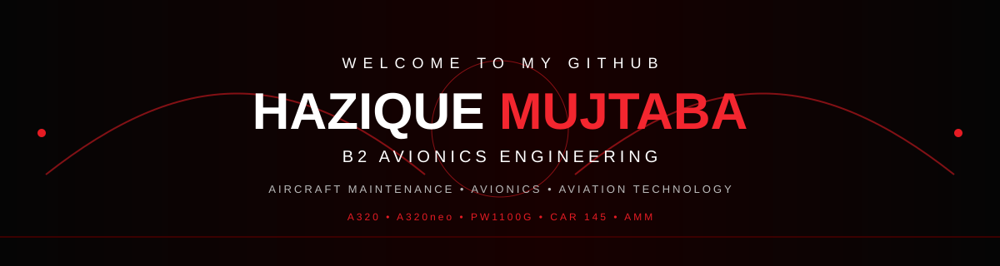
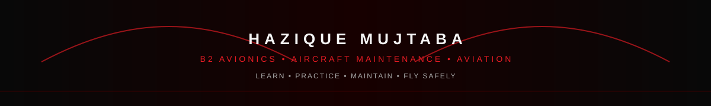

  

  

  
  &nbsp;
  

  

---

<h2 align="center">🔴 About Me</h2>

  

  Hey! I'm <b>Hazique Mujtaba</b>, a B2 Avionics Engineering student from India. 
  I'm passionate about <b>Aircraft Maintenance, Avionics, Aviation Technology, and Aircraft Systems.</b> 
  I enjoy gaining practical experience, learning aircraft systems, and developing my technical skills.

  
  &nbsp;
  
  &nbsp;
  

  💬 <b>Interests:</b> Aircraft Maintenance • Avionics • Aircraft Systems • Aviation Technology 
  ⚡ <b>Philosophy:</b> <i>"Learn continuously. Work precisely. Fly safely."</i>

---

<h2 align="center">✈️ Aviation Profile</h2>

<table width="100%" border="0" align="center">

<tr>
<td width="50%" align="center" style="padding: 18px;">
  <h3>🛩️ B2 Avionics</h3>
  
Aircraft Maintenance Engineering with focus on Avionics.

</td>

<td width="50%" align="center" style="padding: 18px;">
  <h3>🔧 Aircraft Maintenance</h3>
  
Practical exposure to aircraft maintenance and aviation safety procedures.

</td>
</tr>

<tr>
<td width="50%" align="center" style="padding: 18px;">
  <h3>✈️ Airbus A320 Family</h3>
  
A320 & A320neo practical maintenance exposure.

</td>

<td width="50%" align="center" style="padding: 18px;">
  <h3>⚡ Avionics Systems</h3>
  
Exposure to communication, navigation and electrical systems.

</td>

</tr>

</table>

---

<h2 align="center">💼 Experience</h2>

<table width="100%" border="0" align="center">

<tr>
<td align="center" style="padding: 20px;">

<h3>🔧 Junior Aircraft Maintenance Technician cum Store Assistant</h3>

<b>International Aircraft Sales Private Limited (IASPL)</b>

<b>Jun 2026 – Present · Bhopal, Madhya Pradesh</b>

Currently contributing to aviation maintenance and operational activities
while developing practical technical and aviation skills.

</td>
</tr>

<tr>
<td align="center" style="padding: 20px;">

<h3>✈️ Trainee — Indamer Aviation Pvt. Ltd.</h3>

<b>Jan 2026 – Apr 2026 · Nagpur, Maharashtra</b>

Completed <b>360 hours</b> of practical training at Indamer Technics'
DGCA-approved MRO facility under a CAR 145 AMO environment.

Hands-on exposure to line and base maintenance on the
<b>Airbus A320 Family and A320neo</b> powered by
<b>Pratt & Whitney PW1100G-JM</b> engines.

</td>
</tr>

</table>

---

<h2 align="center">🛠️ Technical Skills</h2>

<b>Aircraft Maintenance & Avionics</b>

&nbsp;

&nbsp;

&nbsp;

&nbsp;

<b>Practical Competencies</b>

&nbsp;

&nbsp;

&nbsp;

&nbsp;

---

<h2 align="center">📚 Practical Training</h2>

<b>360 Hours — Outsource Practical Training</b> 
Indamer Technics Pvt. Ltd. — DGCA-approved MRO Facility

🔴 Line & Base Maintenance Exposure 
🔴 Airbus A320 Family & A320neo 
🔴 PW1100G-JM Engine Aircraft 
🔴 Electrical Wiring & Bonding 
🔴 Continuity Testing 
🔴 Communication & Navigation Systems 
🔴 Aircraft Maintenance Manual (AMM)

---

<h2 align="center">🎓 Education</h2>

<b>Aircraft Maintenance Engineering — Avionics</b> 
Institute of Aeronautics & Engineering, Bhopal

<b>Aircraft Maintenance Engineering</b> 
Airframe Mechanics & Aircraft Maintenance Technology / Technician

---

<h2 align="center">🏆 Certifications & Training</h2>

🔴 <b>360-Hour Aircraft Maintenance Practical Training</b> — Indamer Technics 
🔴 <b>Aircraft Maintenance Engineering — Avionics</b> 
🔴 <b>CAR 145 AMO Environment Practical Exposure</b> 
🔴 <b>Aircraft Maintenance & Avionics Training</b>

---

<h2 align="center">📊 GitHub Activity</h2>

  

  

  

---

<h2 align="center">🌟 Currently Learning</h2>

✈️ Aircraft Avionics & Maintenance 
⚡ Aircraft Electrical & Electronic Systems 
📖 Aircraft Maintenance Manual (AMM) 
🔧 Aircraft Maintenance Practices 
💻 Technology & Digital Skills

---

<h2 align="center">📬 Let's Connect</h2>

  <i>Interested in aviation, aircraft maintenance, avionics, technology or collaboration?</i>

  

  <b>❤️ Thanks for visiting my profile!</b>

  

